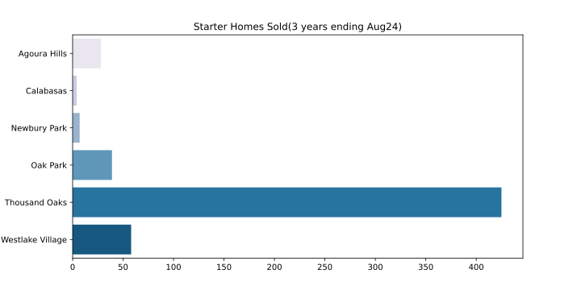

## Overview

Explore the Starter Home Market of the Conejo Valley Area in Southern California. 

#### Select Questions

&emsp; - What is the price range for a typical Starter Home?  
&emsp; - How many have been sold in the last year?  
&emsp; - Where in the valley are they located?  
&emsp; - What is the most popular configuration of Bedrooms and Bathrooms?  
&emsp; - Is a Starter Home a good deal? 

## Starter Homes and Local Real Estate

I live in The Conejo Valley area of Southern California. Located about ten miles inland and separated by a mountain range from the ocean. The climate is cool in the summer and warm in the winter. Moreover, it's conveniently situated near the San Fernando Valley and Los Angeles area. The Conejo Valley includes some or all of the cities of Thousand Oaks, Newbury Park, Oak Park, Agoura Hills, Westlake Village, and Calabasas. 

The area is ideal for commuting both North and South. A perfect place for a family to live and work. That is if you can afford it... 

#### How is a Starter Home defined?

Typically a Starter Home is defined as a small affordable home. This analyis defines it as:
- A free standing residence of less than 1400 square feet
- Has recently been sold, in the last 3 years, for between $250k and $1,250k

#### The Data Set

&emsp; - Zillow sales data pulled for the last 3 years(Sept21 - Aug24)  
&emsp; - The CompCrunch chrome extension was used to facilitate the data pull from Zillow  
&emsp; - CSV files were combined for the six zipcodes(91301, 91320, 91360, 91361, 91362, 91377).  
&emsp; - Cleaned and filtered down to 583 properties

**Data Columns**: address, zipCode, city, state, price, bed, bath, sqft,
       pricePerSf, lotArea, lotAreaType, dateSold, dateSoldNumeric,
       zillowUrl, latitude, longitude, homeType, zestimate,
       rentZestimate, imageUrl

## Analysis

#### Price Range

The vast majority of Starter Homes, 90%, sold for between $500k and $977k.  
  
  
    
Here are the prices broken down by City.  
  
  
  
#### Sales, Where and How Many?
  
In the last year(Sept23-Aug24) 165 Starter Homes were sold and most were located in Thousand Oaks. No Starter Homes were sold in Newbury Park in the 12 months ending August 2024.  
   
**Last Year**  

165 homes sold    
  
  
**Last Three Years**  

583 homes sold     
  

#### The Ideal Starter Home  
  
By far, the most popular configuration for a Starter Home in the Area is a 3 Bedroom / 2 Bath residence.  
  
  

#### Is it a Good Deal?  

To make a comparison between Starter Homes and Other Homes I use price($) per square foot. The average Starter Home is ~$630/sqft while the average for Other homes in the area is ~$560/sqft. This suggests that Starter Homes may not be a 'Good Deal' as they are more expensive in terms of price paid per square foot.  

     

  

  

